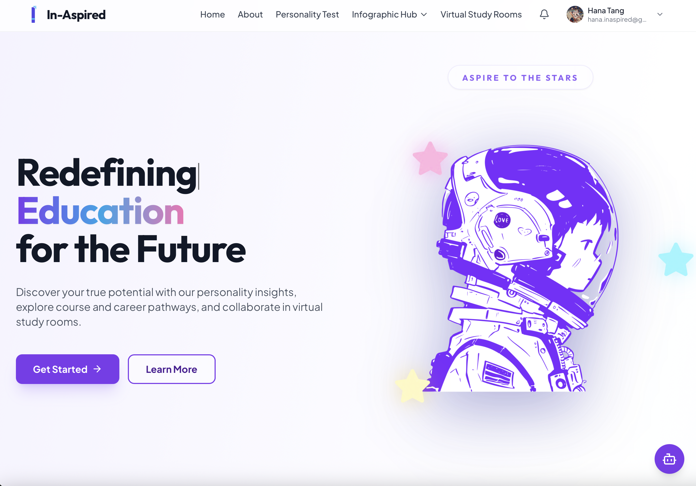
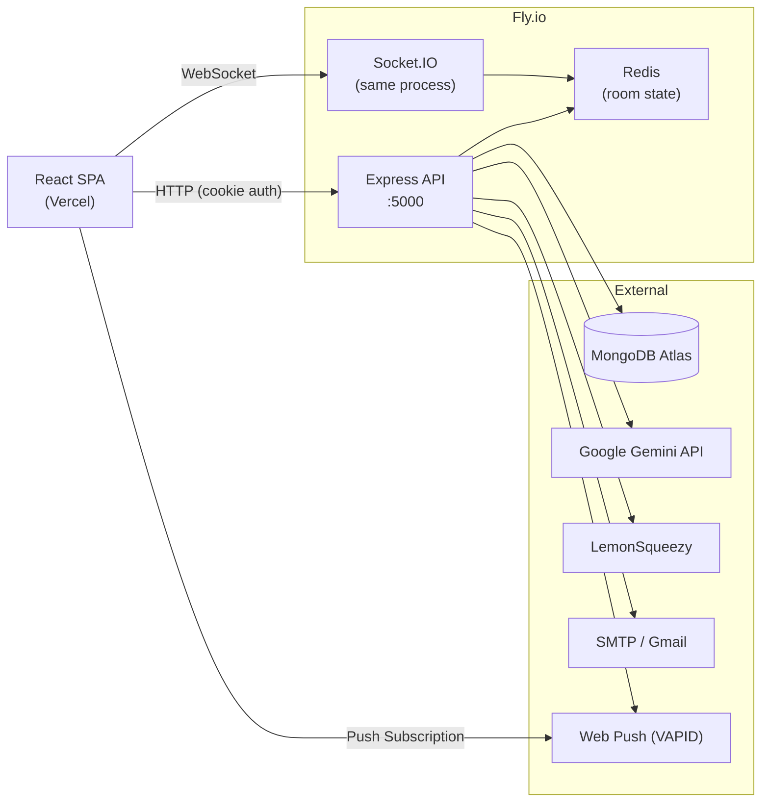

# In-Aspired

> A student guidance platform that combines RIASEC personality assessment, AI-powered career and course discovery, and real-time collaborative study rooms.

[](https://in-aspired.vercel.app)
[](https://www.typescriptlang.org/)
[](https://nodejs.org/)
[](./LICENSE)



## 📺 Demo Video

> **Watch the In-Aspired Demo**

<a href="https://youtu.be/PPMjXniQxJo" target="_blank">
  
</a>

## Table of Contents

- [Overview](#overview)
- [Features](#features)
- [Tech Stack](#tech-stack)
- [Architecture](#architecture)
- [Repo Structure](#repo-structure)
- [Quick Start](#quick-start)
- [Environment Variables](#environment-variables)
- [Local Development](#local-development)
- [Feature Dependencies](#feature-dependencies)
- [API Reference](#api-reference)
- [Testing](#testing)
- [Deployment](#deployment)
- [Troubleshooting](#troubleshooting)
- [Contributing](#contributing)
- [Roadmap](#roadmap)
- [Supporting Docs](#supporting-docs)

---

## Overview

Malaysian secondary school students in Form 4–6 (ages 16–18) face one of the most consequential decisions of their lives — choosing a post-secondary pathway — with little structured support. School counselors are overwhelmed (roughly 1 per 500 students), and generic course catalogs offer no personalised guidance.

In-Aspired addresses this by connecting three things:

1. **Self-understanding** — a RIASEC-based personality test that produces a ranked interest profile
2. **Discovery** — courses and careers matched to that profile, with AI-assisted exploration and semantic search
3. **Action** — real-time virtual study rooms where students can work together, stay accountable, and collaborate

The platform is a production-grade monorepo with a React SPA, a Node.js API backend, MongoDB for persistence, Redis for real-time state coordination, and Google Gemini for AI features.

---

## Features

### Student Flows

| Feature | Description |
|---|---|
| **Personality Test** | 36-question RIASEC assessment with persisted scores and domain-matched recommendations |
| **Course Discovery** | Browse, search, filter, and save courses; semantic vector search powered by Gemini embeddings |
| **Career Discovery** | Career listings matched to RIASEC profile with salary data and study path guidance |
| **AI Chatbot** | Gemini-powered assistant for course, career, and platform queries; detects intent, uses context data, supports English, Chinese, Malay, and Tamil |
| **Virtual Study Rooms** | Real-time rooms with WebRTC video, shared whiteboard (Excalidraw), chat, file resources, to-do lists, ambient music, and synchronized countdown timer |
| **Premium Reports** | LemonSqueezy-gated 14-page PDF career analysis report, generated via Puppeteer and delivered by email |
| **User Profile** | Avatar, bio, password management, Google OAuth login, optional TOTP 2FA |
| **Notifications** | In-app notification center and Web Push notifications via VAPID |
| **Saved Items** | Bookmark courses and careers for later reference |

### Admin and Operations Flows

| Feature | Description |
|---|---|
| **Content Management** | Create, publish, and archive courses and careers |
| **User Monitoring** | View activity history, suspend accounts, manage roles |
| **Report Center** | Review and resolve user feedback with attachments |
| **Feedback Management** | Intake user feedback with file attachments; resolve or dismiss tickets |
| **API Docs** | Swagger UI at `/api-docs` |
| **Health Check** | `/health` endpoint for uptime monitoring |

---

## Tech Stack

### Frontend — `client/`

| Category | Technology |
|---|---|
| Framework | React 18, Vite |
| Language | TypeScript |
| Styling | Tailwind CSS, Framer Motion |
| Routing | React Router v6 |
| Real-time | Socket.IO Client |
| Whiteboard | Excalidraw |
| Internationalisation | i18next (EN, ZH, MS, TA) |
| Testing | Vitest, React Testing Library |

### Backend — `server/node-backend/`

| Category | Technology |
|---|---|
| Runtime | Node.js 20+ |
| Framework | Express 5 |
| Language | TypeScript |
| Real-time | Socket.IO, Redis adapter |
| Database | MongoDB via Mongoose |
| Cache / State | Redis (ioredis) |
| AI | Google Gemini (chat: `gemini-2.5-flash`; embeddings: `gemini-embedding-001`) |
| PDF | Puppeteer + Chromium |
| Payments | LemonSqueezy |
| Email | Nodemailer (Gmail / SMTP) |
| Auth | HttpOnly cookies, JWT, bcrypt, TOTP (speakeasy) |
| Testing | Jest, Supertest |

### Infrastructure

| Service | Purpose |
|---|---|
| Vercel | Frontend hosting and API proxy |
| Fly.io | Backend container hosting (Docker) |
| MongoDB Atlas | Primary database |
| Redis (Fly.io) | Socket.IO adapter and room state |

---

## Architecture

### System Diagram



### Request Flow

```
Browser
  │
  ├─ REST requests  →  Express routes  →  Controllers  →  Services  →  MongoDB / Redis / Gemini
  │
  └─ Socket events  →  Socket.IO handlers  →  Redis room store  →  Broadcast to room members
```

### Key Design Decisions

- **Cookie-based auth with refresh rotation** — access tokens in httpOnly cookies; a silent refresh retries once on 401 before redirecting to login
- **Background-tolerant boot** — HTTP server starts immediately; MongoDB reconnect retries in the background without blocking the process
- **Async PDF fulfillment** — PDF generation and email delivery run after the webhook response is sent, so LemonSqueezy always gets a fast 200
- **Redis-backed room state** — timer, whiteboard, and participant state live in Redis so they survive process restarts and scale across instances

---

## Repo Structure

```
in-aspired/
├── client/                      # React SPA
│   ├── src/
│   │   ├── components/          # UI components (rooms, courses, admin, shared)
│   │   ├── contexts/            # React contexts (auth, socket, chatbot, notifications)
│   │   ├── pages/               # Route-level page components
│   │   ├── services/            # API clients and HTTP utilities
│   │   └── App.tsx              # Route definitions and layout
│   ├── Dockerfile               # Development Docker image
│   └── vite.config.ts
│
├── server/node-backend/         # Express API + Socket.IO backend
│   ├── src/
│   │   ├── controllers/         # Route handlers (thin layer, delegates to services)
│   │   ├── services/            # Business logic (AI, PDF, payment, email)
│   │   ├── models/              # Mongoose schemas
│   │   ├── routes/              # Express route definitions
│   │   ├── socket/              # Socket.IO event handlers and room state store
│   │   ├── middleware/          # Auth, rate limiting, upload, activity logging
│   │   ├── config/              # Environment config and constants
│   │   └── app.ts               # Express app setup and route mounting
│   ├── __tests__/               # Jest integration tests
│   ├── Dockerfile               # Development Docker image
│   └── Dockerfile.prod          # Production Docker image (Fly.io)
│
├── shared/                      # Shared TypeScript types used by both apps
├── docker-compose.yml           # Local full-stack development setup
├── fly.toml                     # Fly.io backend deployment config
├── vercel.json                  # Vercel frontend deployment config
└── package.json                 # Monorepo root (npm workspaces)
```

---

## Quick Start

The fastest way to get a local environment running:

```bash
# 1. Install all workspace dependencies
npm install

# 2. Build the shared types package first (required)
npm run build --workspace shared

# 3. Configure the backend environment
cp server/node-backend/.env.example server/node-backend/.env
# Edit the .env and fill in at minimum: MONGODB_URI, JWT_SECRET, TWO_FACTOR_ENCRYPTION_KEY

# 4. Start backend and frontend in separate terminals
npm run dev --workspace server/node-backend
npm run dev --workspace client
```

Open `http://localhost:5173`.

---

## Environment Variables

### Backend — `server/node-backend/.env`

| Variable | Required | Description |
|---|---|---|
| `MONGODB_URI` | Yes | MongoDB Atlas connection string |
| `JWT_SECRET` | Yes | Secret for signing JWT access tokens |
| `TWO_FACTOR_ENCRYPTION_KEY` | Yes | AES key for encrypting TOTP secrets |
| `CLIENT_URL` | Yes | Frontend origin (e.g. `http://localhost:5173`) |
| `REDIS_URL` | Rooms at scale | Redis connection string (default: `redis://localhost:6379`) |
| `GEMINI_API_KEY` | AI features | Google Gemini API key |
| `SMTP_SERVICE` | Email | Set to `gmail` to use Gmail; omit to use host/port |
| `SMTP_HOST` | Email | SMTP host (default: Mailtrap sandbox) |
| `SMTP_PORT` | Email | SMTP port (default: `2525`) |
| `SMTP_USER` | Email | SMTP username |
| `SMTP_PASS` | Email | SMTP password or app password |
| `SMTP_FROM_EMAIL` | Email | Sender address shown in emails |
| `GOOGLE_CLIENT_ID` | Google OAuth | Google OAuth 2.0 client ID |
| `GOOGLE_CLIENT_SECRET` | Google OAuth | Google OAuth 2.0 client secret |
| `VAPID_PUBLIC_KEY` | Push notifications | VAPID public key |
| `VAPID_PRIVATE_KEY` | Push notifications | VAPID private key |
| `VAPID_SUBJECT` | Push notifications | Mailto URI for VAPID contact |
| `LEMONSQUEEZY_STORE_ID` | Payments | LemonSqueezy store ID |
| `LEMONSQUEEZY_VARIANT_ID` | Payments | Product variant ID |
| `LEMONSQUEEZY_API_KEY` | Payments | LemonSqueezy API key |
| `LEMONSQUEEZY_WEBHOOK_SECRET` | Payments | Webhook signing secret |
| `PUPPETEER_EXECUTABLE_PATH` | PDF (production) | Path to Chromium binary in Docker |

### Frontend — `client/.env`

| Variable | Required | Description |
|---|---|---|
| `VITE_API_URL` | Yes | Backend base URL (e.g. `http://localhost:5000`) |
| `VITE_GOOGLE_CLIENT_ID` | Google OAuth | Google OAuth 2.0 client ID |

---

## Local Development

### Prerequisites

- Node.js 20+
- npm 9+
- A MongoDB connection string (MongoDB Atlas free tier works)
- Redis (required for full test suite and multi-instance room scaling)

### Manual Setup

```bash
# Install all workspaces
npm install

# Build shared types
npm run build --workspace shared

# Terminal 1 — backend on :5000
npm run dev --workspace server/node-backend

# Terminal 2 — frontend on :5173
npm run dev --workspace client
```

### Docker Setup

Docker Compose starts the client, backend, and Redis together with hot reload volumes:

```bash
docker compose up --build
```

Services:

| Service | Local port |
|---|---|
| React client | `5173` |
| Express API + Socket.IO | `5000` |
| Redis | `6379` |

Stop everything:

```bash
docker compose down
```

---

## Feature Dependencies

Not all features require all services. Use this table to decide what to configure for your use case.

| Feature | Required services |
|---|---|
| Auth, profile, quiz, saved items | MongoDB |
| Virtual rooms (single server) | MongoDB |
| Virtual rooms (multi-instance / scaled) | MongoDB + Redis |
| WebRTC audio/video (cross-network) | Public TURN|
| AI chatbot, intent detection | Gemini API |
| Semantic course/career search | Gemini API + MongoDB vector index |
| Password reset, report delivery | SMTP |
| Google sign-in | Google OAuth credentials |
| Web push notifications | VAPID keys |
| Premium PDF report and payment | LemonSqueezy + SMTP + Puppeteer/Chromium |

---

## API Reference

Backend routes are mounted in [`server/node-backend/src/app.ts`](./server/node-backend/src/app.ts).

| Prefix | Area |
|---|---|
| `/api/auth` | Registration, login, logout, refresh, Google OAuth, 2FA |
| `/api/users` | Profile read/update, password change, account deletion |
| `/api/courses` | Course listing, search, detail, save, admin CRUD |
| `/api/careers` | Career listing, search, detail, save, admin CRUD |
| `/api/recommend` | RIASEC quiz submission and result persistence |
| `/api/careers/match` | Career matching against stored RIASEC scores |
| `/api/save` | Save latest recommendation result |
| `/api/latest` | Fetch latest recommendation result |
| `/api/rooms` | Room creation, listing, join, and settings |
| `/api/resources` | File resource upload and management for rooms |
| `/api/chat` | AI chatbot message handling |
| `/api/notifications` | Notification listing and push subscription management |
| `/api/payment` | LemonSqueezy checkout creation and webhook receiver |
| `/api/admin` | User management, activity logs, payment retry |
| `/api/feedback` | User feedback submission, admin review and resolution |
| `/api/contact` | Public contact form submission (rate limited) |

Interactive Swagger docs are available at `/api-docs` when the backend is running.

---

## Testing

Run all workspace tests from the root:

```bash
npm run test
```

Run per-workspace:

```bash
npm run test --workspace client           # Vitest (React components)
npm run test --workspace server/node-backend  # Jest (API integration)
```

**Current Test Coverage:**

| Workspace | Test Files | Tests |
|-----------|-----------|-------|
| Client (Vitest) | ~8 | ~50+ |
| Server (Jest) | **30** | **344** |

The backend has comprehensive test coverage across:
- All controllers (auth, users, courses, careers, rooms, chat, notifications, payments, feedback, admin)
- All services (AI, notification, payment, email, PDF)
- All middleware (auth, rate limiting, validation, error handling, admin check, upload, activity logging)
- Models (User)

Linting:

```bash
npm run lint
```

Full pre-push check:

```bash
npm run build --workspace shared
npm run test --workspace client
npm run test --workspace server/node-backend
```

See [`TESTING_GUIDE.md`](./TESTING_GUIDE.md) for test writing conventions and coverage targets.

---

## Deployment

The repo is pre-configured for split deployment.

### Backend — Fly.io

Fly deploys from `server/node-backend/Dockerfile.prod` using the config in [`fly.toml`](./fly.toml).

```bash
fly deploy
```

Required secrets on Fly.io (set with `fly secrets set KEY=value`):

- All backend environment variables from the table above
- `PUPPETEER_EXECUTABLE_PATH` must point to the Chromium binary inside the Docker image

### Frontend — Vercel

Vercel builds the `shared` package first, then the `client`. [`vercel.json`](./vercel.json) rewrites all `/api/*` and `/socket.io/*` requests to the Fly.io backend.

Push to `main` to trigger a Vercel deployment, or deploy manually:

```bash
vercel --prod
```

Set `VITE_API_URL` and `VITE_GOOGLE_CLIENT_ID` in Vercel environment settings.

---

## Troubleshooting

| Symptom | Likely cause | Fix |
|---|---|---|
| `Cannot find module @in-aspired/shared` | `shared` not built | Run `npm run build --workspace shared` |
| Protected routes redirect to login immediately | Cookie or CORS misconfiguration | Check `CLIENT_URL`, `VITE_API_URL`, and cookie `SameSite`/`Secure` settings |
| Rooms work locally but lose state across restarts | Redis not configured | Set `REDIS_URL` and confirm Redis is reachable |
| AI chatbot returns fallback responses | Gemini API key missing or invalid | Check `GEMINI_API_KEY` in backend env |
| Premium report payment succeeds but no email received | Puppeteer crash, SMTP misconfiguration, or user has no test result | Check Fly.io logs for `[PdfService]` or `[FULFILLMENT_FAILED]`; verify `SMTP_SERVICE=gmail` and valid app password; confirm user completed personality test |
| PDF generation fails in production | Chromium not found | Set `PUPPETEER_EXECUTABLE_PATH` to the correct binary path in the Docker image |
| Semantic search returns weak results | Vector index not set up or embeddings not generated | See [`VECTOR_SEARCH_SETUP.md`](./VECTOR_SEARCH_SETUP.md) |
| Webhook rejected with 400 | `LEMONSQUEEZY_WEBHOOK_SECRET` not set on server | Set the secret in Fly.io secrets and confirm it matches the LemonSqueezy dashboard |
| Google login fails | Mismatched OAuth client ID or redirect URI | Check `GOOGLE_CLIENT_ID` matches on both frontend and backend; verify authorised redirect URIs in Google Console |

---

## Contributing

### Workflow

1. Read the relevant feature flow across `client/` and `server/node-backend/` before making changes
2. Implement changes as a vertical slice when the feature spans UI and API
3. Rebuild `shared` if you changed shared types
4. Run the relevant test suite before pushing
5. Update the nearest README or doc file if observable behaviour changed

### Before opening a PR

```bash
npm run build --workspace shared
npm run test --workspace client
npm run test --workspace server/node-backend
npm run lint
```

---

## Roadmap

- Richer premium reports with progress tracking over time
- Improved recommendation ranking using feedback signals
- Room analytics and accountability features (attendance, focus streaks)
- Admin dashboard insights for content quality and user behaviour
- Observability improvements for payment fulfillment and email delivery pipelines
- Dedicated TURN server for WebRTC audio/video (currently using free public relay)

---

## Supporting Docs

| Document | Purpose |
|---|---|
| [`client/README.md`](./client/README.md) | Frontend architecture and component overview |
| [`server/node-backend/README.md`](./server/node-backend/README.md) | Backend architecture, middleware, and service details |
| [`TESTING_GUIDE.md`](./TESTING_GUIDE.md) | Test conventions and coverage strategy |
| [`SECURITY.md`](./SECURITY.md) | Security policy and vulnerability reporting |
| [`VECTOR_SEARCH_SETUP.md`](./VECTOR_SEARCH_SETUP.md) | MongoDB Atlas vector search index setup |

---

## Implementation Notes

- **Recommendation endpoints** are mounted directly under `/api` (e.g. `/api/recommend`, `/api/save`) rather than under a `/api/recommendations` namespace for historical reasons
- **Auth state** uses both httpOnly cookies and a cached frontend user context together; feature work that touches auth usually needs changes in both the backend session endpoints and the client `AuthContext`
- **PDF fulfillment** runs asynchronously after the webhook response is sent; the `transactions` collection tracks `fulfillmentStatus` (`pending` → `processing` → `delivered` / `failed`) and failed deliveries can be retried via `POST /api/admin/payment/retry/:transactionId`
